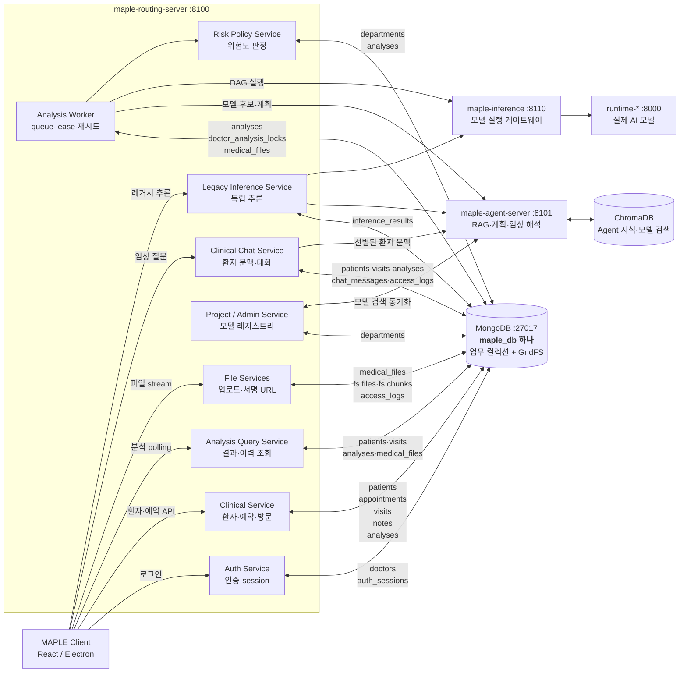
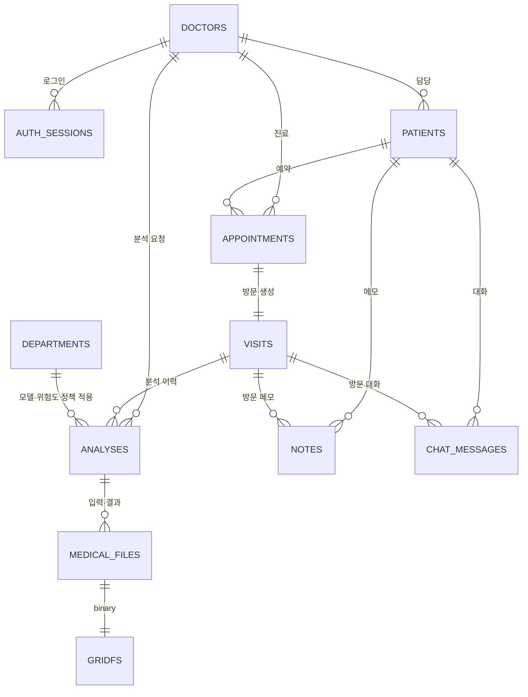
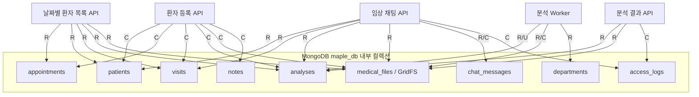
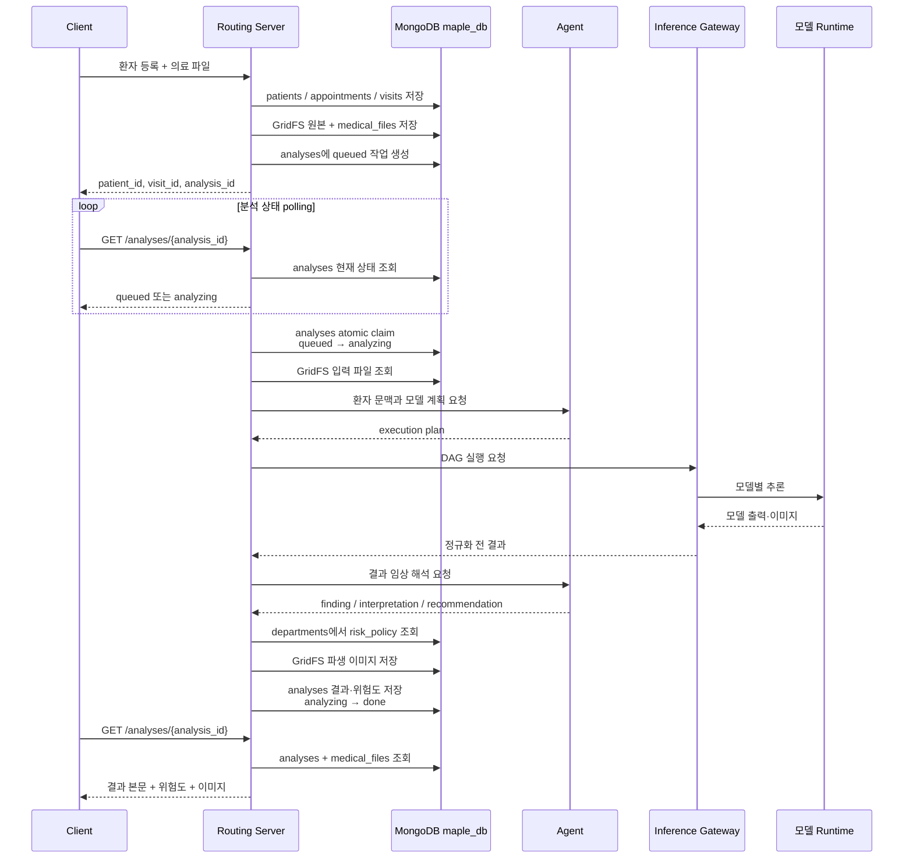
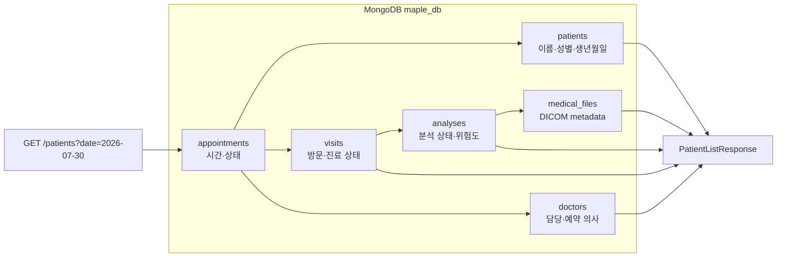

# MAPLE Routing Server 개요

## 1. 이 서버는 무엇인가

`maple-routing-server`는 MAPLE 의료 AI 플랫폼의 중심 백엔드입니다.

클라이언트가 환자와 진료 일정을 관리하고 의료 영상을 분석할 때, 이 서버가
업무 데이터와 AI 시스템 사이의 경계를 담당합니다. 단순한 AI 모델 프록시가
아니라 다음 책임을 함께 가집니다.

- 의사 인증과 권한 확인
- 환자, 예약, 방문, 분석 기록 관리
- 의료 파일 저장과 접근 통제
- 분석 작업의 순서와 실행 상태 관리
- AI Agent와 모델 실행 서버 호출
- 모델 출력을 임상 화면용 결과로 정규화
- 모델별 정책에 따른 위험도 판정
- 환자의 과거 방문을 포함하는 임상 채팅 문맥 구성

즉, 이 서버는 클라이언트가 사용하는 임상 API이면서 AI 분석 작업을 조율하는
오케스트레이터입니다.

## 2. 시스템 안에서의 위치

```text
┌─────────────────────────────────────────────────────────────┐
│ 사용자 PC                                                   │
│                                                             │
│  maple-client                                               │
│  - 환자 목록과 진료 일정                                    │
│  - 의료 영상 뷰어                                           │
│  - 분석 결과와 임상 채팅                                    │
└──────────────────────────┬──────────────────────────────────┘
                           │ HTTP + Bearer token
                           ▼
┌─────────────────────────────────────────────────────────────┐
│ A100 서버                                                   │
│                                                             │
│  maple-routing-server :8100                                 │
│  - 인증, 임상 데이터, 파일, 큐, 정책                        │
│  - Agent와 모델 실행 서버 호출                              │
│                                                             │
│  MongoDB :27017                                             │
│  - replica set                                              │
│  - 업무 문서 + GridFS                                       │
│                                                             │
│  maple-inference :8110                                      │
│  - 모델 런타임 게이트웨이                                   │
│  - runtime-basic / medical / yolo / nnunet                  │
│  - 8개 진료과 72종 모델                                     │
└──────────────────────────┬──────────────────────────────────┘
                           │ 사설망
                           ▼
┌─────────────────────────────────────────────────────────────┐
│ H100 서버                                                   │
│                                                             │
│  maple-agent-server :8101                                   │
│  - 자연어 요청 분석                                         │
│  - 모델 선택과 실행 계획                                    │
│  - VLM 임상 해석                                            │
│  - ChromaDB / Wiki RAG                                      │
└─────────────────────────────────────────────────────────────┘
```

클라이언트는 Agent나 모델 컨테이너를 직접 호출하지 않습니다. 인증, 환자 문맥,
파일 권한, 실행 상태가 모두 라우팅 서버를 통과하도록 구성되어 있습니다.

## 3. 컴포넌트와 데이터베이스 통신

### 먼저 알아둘 점: DB가 여러 개인가

의사 DB, 환자 DB, 분석 DB가 각각 별도의 MongoDB 서버로 존재하는 것은
아닙니다. 물리적으로는 `maple_db`라는 하나의 MongoDB database이고, 업무
성격에 따라 여러 컬렉션으로 나뉩니다.

```text
MongoDB Server :27017
└── maple_db
    ├── doctors                  의사 계정
    ├── auth_sessions            로그인 session
    ├── patients                 환자 기본 정보
    ├── appointments             예약
    ├── visits                   진료 방문
    ├── analyses                 AI 분석 요청·상태·결과
    ├── medical_files            의료 파일 메타데이터
    ├── fs.files / fs.chunks     실제 파일 본문
    ├── notes                    임상 메모
    ├── chat_messages            임상 채팅
    ├── departments              모델 레지스트리·위험도 정책
    ├── inference_results        레거시 추론 기록
    ├── doctor_analysis_locks    worker lock
    ├── counters                 ID sequence
    └── access_logs              의료 데이터 접근 감사
```

### 전체 데이터 아키텍처



이 그림에서 중요한 경계는 다음과 같습니다.

1. 클라이언트는 어떤 DB 컬렉션에도 직접 접근하지 않습니다.
2. Agent와 모델 runtime도 `maple_db`를 직접 읽지 않습니다.
3. 라우팅 서버가 DB에서 필요한 정보만 꺼내 외부 AI 서버에 전달합니다.
4. 외부 AI 응답은 라우팅 서버가 검증한 뒤 같은 `maple_db`의 `analyses`,
   `medical_files`, GridFS에 저장합니다.
5. 업무 상태의 기준은 클라이언트나 Agent가 아니라 MongoDB 문서입니다.

별도 저장소는 H100 Agent가 RAG와 모델 검색에 사용하는 ChromaDB입니다.
ChromaDB에는 Agent 지식과 모델 검색 정보가 들어가며, 환자 차트의 원본 저장소로
사용하지 않습니다.

### 모델 자산과 레지스트리

2026-07-30 기준 모델 실행 서버에는 8개 진료과, 72종 모델이 있습니다.

| 진료과 | 모델 수 |
|---|---:|
| Cardiology | 7 |
| Dermatology | 7 |
| Gastroenterology | 4 |
| Neurology | 9 |
| Obstetrics | 5 |
| Ophthalmology | 4 |
| Orthopedics | 19 |
| Pulmonology | 17 |
| **합계** | **72** |

모델 수는 라우팅 서버가 임의로 정한 상수가 아닙니다. 모델 실행 서버의
`AI_Models/{department}/{model}/meta.json`을 스캔한 결과이며, 동일한 72개
모델에 대응하는 `models/{model}/config.yaml`이 실행 runtime을 선언합니다.
`scan_and_register.py`는 이 메타데이터를 읽어 `maple_db.departments`에
레지스트리를 만들고 Agent의 모델 검색 정보와 동기화합니다.

```text
AI_Models/*/*/meta.json (72)
        │ scan_and_register.py
        ├──▶ maple_db.departments
        └──▶ Agent 모델 검색 / Wiki

models/*/config.yaml (72)
        └──▶ maple-inference ──▶ runtime-* ──▶ 실제 모델 실행
```

### 컬렉션별 데이터 소유권

| 컬렉션 그룹 | 컬렉션 | 기록의 의미 | 주로 읽고 쓰는 서버 구성요소 |
|---|---|---|---|
| 의사·인증 | `doctors`, `auth_sessions` | 누가 로그인했고 어떤 권한을 가졌는가 | Auth Service |
| 환자 | `patients` | 변하지 않는 환자 기본 차트 | Clinical Service, Chat Service |
| 예약 | `appointments` | 언제 어떤 의사가 진료하는가 | Clinical Service |
| 방문 | `visits` | 실제 한 번의 진료 단위 | Clinical Service, Query, Chat |
| 분석 | `analyses` | 무엇을 분석 중이며 결과가 무엇인가 | Clinical Service, Worker, Query |
| 분석 lock | `doctor_analysis_locks` | 어떤 worker가 의사 queue를 처리하는가 | Analysis Worker |
| 의료 파일 | `medical_files`, GridFS | 입력 영상과 결과 이미지 | File Service, Worker, Query |
| 임상 기록 | `notes`, `chat_messages` | 사람이 남긴 메모와 AI 대화 | Note Service, Chat Service |
| 모델 | `departments` | 모델 위치·입력 형식·위험도 정책 | Project/Admin, Worker, Risk Policy |
| 레거시 추론 | `inference_results` | 환자와 무관한 레거시 추론 결과 | Legacy Inference Service |
| 운영 | `counters`, `access_logs` | ID 발급과 의료 데이터 접근 이력 | 여러 Service |

### 환자 한 명의 데이터가 연결되는 모습



MongoDB 자체가 관계를 자동으로 join하는 구조는 아닙니다. 라우팅 서버가
`patient_id`, `appointment_id`, `visit_id`, `analysis_id`, `doctor_id`를 이용해
관련 문서를 조회하고 API 응답으로 조합합니다.

### 서버 기능별 컬렉션 읽기·쓰기



표기:

- `C`: create
- `R`: read
- `U`: update

### 분석 데이터 생명주기

분석은 `maple_db` 안의 여러 컬렉션과 외부 AI 서버를 순서대로 통과합니다.



### 조회 화면이 만들어지는 과정

환자 목록 한 줄도 단일 컬렉션의 문서를 그대로 반환한 것이 아닙니다.



분석 문서가 없으면 라우팅 서버가 `waiting_for_files`를 합성합니다. 화면에
보이는 상태가 항상 어떤 컬렉션의 단일 필드와 1:1로 대응하는 것은 아닙니다.

### 통신 원칙

MongoDB에 직접 연결하는 컴포넌트는 `maple-routing-server`뿐입니다.

```text
maple-client ──HTTP──► maple-routing-server ──Motor──► MongoDB
                               │
                               ├──HTTP──► maple-agent-server
                               └──HTTP──► maple-inference ──► runtime-*
```

- 클라이언트는 MongoDB 주소와 DB credential을 알지 못합니다.
- Agent는 `maple_db`의 환자 컬렉션을 직접 조회하지 않습니다.
- 모델 실행 서버는 환자·예약·위험도 컬렉션에 접근하지 않습니다.
- 라우팅 서버가 필요한 환자 문맥과 파일만 선별해 외부 AI 서버에 전달합니다.
- Agent와 모델의 응답은 라우팅 서버가 검증·정규화한 뒤 MongoDB에 저장합니다.

MongoDB는 다른 컴포넌트에 요청을 보내는 능동적인 서비스가 아닙니다. 모든 읽기와
쓰기는 라우팅 서버의 Controller → Service → Repository 흐름에서 시작됩니다.

### 통신 방식

| 출발 | 도착 | 방식 | 전달 내용 |
|---|---|---|---|
| 클라이언트 | 라우팅 서버 | HTTP/JSON, multipart | 로그인, 환자 업무 요청, 의료 파일 |
| 라우팅 서버 | MongoDB | Motor/PyMongo | 업무 문서, queue 상태, GridFS 파일 |
| 라우팅 서버 | Agent | HTTP/JSON | 질문, 환자 문맥, 실행 계획 입력, 모델 결과 |
| 라우팅 서버 | 추론 게이트웨이 | HTTP/JSON | 모델 ID, 입력 경로·데이터, 실행 parameter |
| 추론 게이트웨이 | 모델 runtime | HTTP/JSON | runtime별 정규화된 추론 요청 |
| 라우팅 서버 | 클라이언트 | HTTP/JSON, stream | 업무 DTO, 분석 결과, 서명된 파일 |

애플리케이션 시작 시 `connect_database()`가 Motor client와 database handle을
만들고, FastAPI lifespan 동안 재사용합니다. 요청마다 새 MongoDB 연결을 만들지
않으며 Motor의 connection pool을 공유합니다. 종료 시 worker를 먼저 중단하고
MongoDB client를 닫습니다.

### 코드에서 DB까지 가는 경로

```text
HTTP Request
  │
  ▼
Controller
  - 입력 형식과 인증 확인
  - HTTP 오류·응답 형식 결정
  │
  ▼
Service
  - 업무 규칙 적용
  - 여러 repository 작업 조합
  - transaction과 외부 AI 호출 관리
  │
  ▼
Repository
  - MongoDB query
  - atomic update / find_one_and_update
  │
  ▼
MongoDB / GridFS
```

Controller가 컬렉션 구조를 직접 다루지 않도록 하고, 외부 AI 서버에는 repository
객체나 MongoDB 문서를 그대로 전달하지 않습니다. Service가 필요한 필드만 별도의
실행 문맥으로 구성합니다.

### 컬렉션 사이의 연결

MongoDB는 관계형 DB의 foreign key를 사용하지 않지만 업무 ID로 문서를
연결합니다.

```text
patients.patient_id
  │
  ├── appointments.patient_id
  │      └── visits.appointment_id
  │             ├── analyses.visit_id
  │             │      └── medical_files.analysis_id
  │             ├── notes.visit_id
  │             └── chat_messages.visit_id
  │
  └── access_logs.patient_id
```

주요 연결 키:

| 부모 | 자식 | 연결 필드 |
|---|---|---|
| `patients` | `appointments` | `patient_id` |
| `appointments` | `visits` | `appointment_id` |
| `visits` | `analyses` | `visit_id` |
| `analyses` | `medical_files` | `analysis_id` |
| `doctors` | 예약·방문·분석 | MongoDB `_id` |
| `medical_files` | GridFS | `gridfs_id` |

화면 DTO를 만들 때 라우팅 서버가 이 키들을 이용해 여러 컬렉션을 조합합니다.
예를 들어 날짜별 환자 목록은 `appointments`를 시간순으로 조회한 뒤 `patients`,
`visits`, 최신 `analyses`, `doctors`, DICOM `medical_files`를 결합해 만듭니다.

### 날짜별 환자 목록 조회

```text
Client
  → GET /patients?date=2026-07-30

Routing Server
  → appointments: 해당 날짜의 취소되지 않은 예약 조회
  → patients: 예약에 포함된 환자 일괄 조회
  → doctors: 담당·예약 의사 조회
  → visits: 예약별 방문 조회
  → analyses: 방문별 최신 활성 분석 조회
  → medical_files: 입력 DICOM 메타데이터 조회
  → analysis가 없으면 waiting_for_files 합성

Client
  ← 시간순 PatientListResponse
```

`waiting_for_files`는 MongoDB에 가짜 분석 문서를 저장하는 대신 조회 결과를 만들
때 합성합니다. 따라서 “파일이 없는 방문”과 “분석 queue에 들어간 방문”을 DB
구조상 명확히 구분할 수 있습니다.

### 환자 등록 transaction

```text
Client
  → POST /patients + form + files

Routing Server
  → 입력 파일을 임시 파일로 streaming
  → GridFS 본문 + medical_files(staging) 저장
  → MongoDB transaction 시작
       ├── counters: patient/appointment/visit/analysis ID 발급
       ├── patients insert
       ├── appointments insert
       ├── visits insert
       ├── notes insert (선택)
       ├── analyses queued insert (파일이 있을 때)
       └── medical_files를 active로 전환하고 업무 ID 연결
  → commit

Client
  ← 생성된 업무 ID와 analysis_status
```

중간 단계가 실패하면 transaction을 중단해 환자만 있고 예약은 없는 식의 부분
데이터를 방지합니다. transaction 전에 저장한 staging 파일은 orphan 상태로
표시해 활성 업무 데이터에서 제외합니다. MongoDB replica set이 필요한 이유가
이 transaction 지원 때문입니다.

### 분석 worker와 DB 상태 교환

worker는 별도 메시지 브로커 대신 `analyses` 컬렉션을 durable queue로
사용합니다.

```text
AnalysisWorker
  → analyses에서 status=queued인 의사 조회
  → doctor_analysis_locks lease 획득
  → find_one_and_update로 분석 하나를 atomic claim
       status: queued → analyzing
       worker_id, started_at, lease_expires_at 기록
  → MongoDB/GridFS에서 입력 파일과 문맥 조회
  → Agent에 계획 요청
  → 추론 게이트웨이에 모델 실행 요청
  → Agent에 해석 요청
  → 결과 이미지 GridFS 저장
  → analyses 결과와 위험도 저장
       status: analyzing → done
  → 의사 lock 해제
```

heartbeat는 분석과 의사 lock의 `lease_expires_at`을 주기적으로 연장합니다.
프로세스가 죽어 heartbeat가 멈추면 다른 worker가 만료된 작업을 `queued`로
되돌리거나 최대 시도 횟수에 따라 `failed`로 끝냅니다.

이 구조에서 상태의 최종 소유자는 DB입니다. 클라이언트 메모리나 worker
프로세스가 사라져도 `analyses` 문서로 실행 상태를 복구할 수 있습니다.

### Agent와 환자 데이터 사이의 경계

임상 채팅에서 Agent가 MongoDB를 검색하는 것이 아닙니다.

```text
Routing Server
  → patients에서 기본 정보 조회
  → analyses에서 여러 방문의 최근 결과 조회
  → chat_messages에서 대화 이력 조회
  → 허용할 이미지 token 목록 생성
  → 필요한 정보만 JSON 문맥으로 직렬화
  → Agent 호출

Agent
  → 전달받은 문맥과 RAG 지식으로 답변 생성
  → 텍스트와 선택적 [IMG:...] token 반환

Routing Server
  → token이 실제 medical_files와 연결되는지 검증
  → chat_messages에 user/assistant 문서 저장
  → access_logs에 접근 감사 기록 저장
```

Agent가 존재하지 않는 분석 ID나 파일을 답변에 넣어도 라우팅 서버의 token
registry에 없으면 클라이언트 파일 URL로 변환되지 않습니다.

### 파일 본문과 메타데이터의 분리

```text
medical_files                 GridFS
─────────────                 ──────
file_id                       fs.files._id
gridfs_id ──────────────────► 파일 메타
patient_id                    fs.chunks
visit_id                      실제 binary chunks
analysis_id
role / sha256 / DICOM metadata
```

업무 조회는 작은 `medical_files` 문서로 처리하고, 실제 대용량 본문은 필요할
때만 GridFS stream으로 읽습니다. 파일 API는 전체 파일을 메모리에 올리지 않고
64 KiB chunk 단위로 클라이언트에 전달합니다.

분석 실행 시에는 GridFS 입력을 `CLINICAL_WORK_DIR` 아래 작업 디렉터리로
준비하고, 모델 게이트웨이와 runtime이 접근할 수 있는 경로 또는 정규화된
데이터로 전달합니다. 실행이 끝난 파생 이미지는 다시 GridFS에 보존합니다.

### 인증 session과 DB

```text
POST /auth/login
  → doctors 조회
  → Argon2 hash 검증
  → auth_sessions insert
  ← access token + refresh token

인증 요청
  → JWT signature와 만료 검증
  → auth_sessions의 활성 상태 확인
  → doctors의 활성 계정·역할 확인

POST /auth/refresh
  → 기존 refresh hash 비교
  → refresh token 회전

POST /auth/logout
  → auth_sessions.revoked_at 기록
```

JWT만 신뢰하지 않고 session 상태를 DB에서 함께 확인하므로 logout과 refresh
token 재사용 감지를 서버에서 통제할 수 있습니다.

### 데이터 일관성 전략

| 상황 | 사용 기법 |
|---|---|
| 환자·예약·방문 동시 생성 | MongoDB transaction |
| 같은 의사·같은 예약 시각 | partial unique index |
| 업무 ID 발급 | `counters` atomic increment |
| 분석 하나만 claim | `find_one_and_update` |
| worker 장애 복구 | lease와 heartbeat |
| 새 분석과 과거 결과 구분 | `superseded` 상태 |
| 파일 무결성 | SHA-256 |
| 파일 접근 권한 | HMAC 서명 URL + 만료 |
| 인증 session 만료 | TTL index |
| 접근 로그 만료 | TTL index |

## 4. 핵심 도메인

### 4.1 의사

`doctors`는 로그인 주체이자 데이터 접근 주체입니다.

- `employee_id`로 로그인
- 비밀번호는 Argon2 hash로 저장
- access token과 refresh token 사용
- 역할은 `doctor`, `admin`으로 구분
- refresh session은 `auth_sessions`에서 관리

일반 임상 API는 doctor 역할이 필요하며, 모델 레지스트리를 변경하는
`/admin/*` API는 admin 역할이 필요합니다.

### 4.2 환자

`patients`는 환자의 기본 차트입니다.

- 환자 ID
- 이름, 성별, 생년월일
- 담당 의사
- 진료 상태
- 보관 여부

환자 정보와 특정 날짜의 진료는 분리되어 있습니다. 같은 환자가 다시 방문하면
환자 문서를 새로 만들지 않고 새로운 예약과 방문을 생성합니다.

### 4.3 예약

`appointments`는 일정 화면의 기준입니다.

- 진료 날짜와 시각
- 해당 진료의 의사
- `scheduled`, `completed`, `cancelled` 상태
- 활성 슬롯 점유 여부

예약은 08:00부터 17:00까지 10분 단위로 받습니다. 과거 날짜와 현재 시각
이전의 예약도 과거 진료 기록 입력을 위해 허용합니다. 다만 같은 병원, 같은
의사, 같은 시각의 활성 예약은 unique index로 차단합니다.

### 4.4 방문

`visits`는 실제 진료 단위입니다.

예약 하나에 방문 하나가 연결됩니다. 분석, 임상 메모, 채팅은 방문을 중심으로
묶입니다.

```text
Patient
  └── Appointment
        └── Visit
              ├── Analysis 1
              ├── Analysis 2
              ├── Notes
              └── Chat messages
```

예약을 취소하면 연결 방문도 취소 상태로 바뀝니다. 진료 완료 처리 역시 예약과
방문을 함께 변경합니다.

### 4.5 분석

`analyses`는 AI 분석 요청과 결과를 모두 담습니다.

```text
queued
  │
  ▼
analyzing
  ├── done
  ├── failed
  └── cancelled
```

`waiting_for_files`는 DB에 저장되는 분석 상태가 아닙니다. 방문에 활성 분석
문서가 없을 때 목록 API가 합성하는 화면용 상태입니다.

새 분석을 요청하면 기존 결과는 보존하면서 필요에 따라 이전 분석을
`superseded`로 표시할 수 있습니다.

## 5. 대표 요청 흐름

### 5.1 로그인

```text
Client
  → POST /auth/login
Routing Server
  → employee_id 조회
  → Argon2 비밀번호 검증
  → auth_sessions 생성
  ← access token + refresh token + doctor 정보
```

access token은 API 인증에 사용하고, refresh token은 DB session과 함께
회전시킵니다. logout하면 해당 session을 폐기합니다.

### 5.2 신규 환자 접수

```text
POST /patients
  │
  ├── 환자 입력 검증
  ├── 의사 슬롯 충돌 검사
  ├── patients 생성
  ├── appointments 생성
  ├── visits 생성
  ├── notes 생성(선택)
  ├── medical_files 저장(선택)
  └── analyses queued 생성(파일이 있을 때)
```

여러 컬렉션을 함께 생성하므로 MongoDB transaction을 사용합니다. 이 때문에
개발 환경도 standalone MongoDB가 아니라 replica set으로 실행해야 합니다.

파일이 없으면 분석 문서를 만들지 않습니다. 이후 목록 API는 이 방문을
`waiting_for_files`로 반환합니다.

### 5.3 분석 실행

```text
AnalysisWorker
  │
  ├── queued 상태인 의사 조회
  ├── doctor_analysis_locks lease 획득
  ├── 해당 의사의 가장 이른 분석 claim
  ├── status = analyzing
  ├── heartbeat로 lease 연장
  │
  ├── Agent에 실행 계획 요청
  ├── 모델 게이트웨이에 DAG 실행 요청
  ├── Agent에 결과 해석 요청
  ├── 파생 이미지 GridFS 저장
  ├── RiskPolicyService 평가
  │
  └── status = done
```

한 의사의 분석은 순서대로 하나씩 실행됩니다. 서로 다른 의사는
`ANALYSIS_GLOBAL_CONCURRENCY` 범위에서 병렬 실행됩니다.

worker가 중단되면 lease가 만료된 분석을 다시 `queued`로 되돌립니다. 최대 시도
횟수를 넘긴 작업은 `failed`가 됩니다.

### 5.4 결과 조회

클라이언트는 분석이 끝날 때까지 다음 API를 polling합니다.

```http
GET /analyses/{analysis_id}
```

완료 응답에는 다음 정보가 포함됩니다.

- `finding`
- `interpretation`
- `recommendation`
- `risk_tier`
- `risk_status`
- `confidence`
- 예측 결과
- 결과 이미지 URL
- DICOM 메타데이터

이미지 URL은 짧은 수명을 가진 서명 URL입니다. 만료된 URL은 다음 API로 한
번에 다시 발급합니다.

```http
POST /analyses/{analysis_id}/access-urls
```

### 5.5 임상 채팅

```text
POST /visits/{visit_id}/chat
  │
  ├── 현재 방문과 환자 확인
  ├── 환자의 여러 방문에서 최근 분석 조회
  ├── 기존 채팅 이력 조회
  ├── 허용 가능한 이미지 token registry 생성
  ├── Agent clinical mode 호출
  ├── 응답 이미지 토큰 검증
  └── user/assistant 메시지 저장
```

Agent가 임의의 파일을 노출하지 못하도록, 응답의 이미지 토큰은 서버가 미리
등록한 다음 형식만 허용합니다.

```text
[IMG:{analysis_id}:{role}:{index}]
```

## 6. 파일 처리

업로드 파일의 본문은 MongoDB GridFS에 저장하고, 업무 메타데이터는
`medical_files`에 저장합니다.

```text
medical_files
  ├── file_id
  ├── gridfs_id
  ├── patient_id
  ├── visit_id
  ├── analysis_id
  ├── kind
  ├── role
  ├── content_type
  ├── extension
  ├── sha256
  └── dicom_metadata
```

지원 파일:

- DICOM: `.dcm`, `.dicom`
- NIfTI: `.nii`, `.nii.gz`
- 테이블: `.csv`
- 이미지: `.png`, `.jpg`, `.jpeg`

DICOM 메타데이터는 API에 필요한 항목만 정규화하며 환자 이름과 원본 ID 같은
직접 식별자는 노출하지 않습니다.

파일 다운로드는 다음 형태의 서명 URL을 사용합니다.

```text
/files/{file_id}?exp={unix-time}&sig={hmac}
```

서명은 만료 시각과 파일 ID를 검증합니다. 로그 필터는 URL의 `sig` 값을
마스킹합니다.

## 7. 위험도 판정

위험도는 Agent가 자연어로 결정하지 않습니다.

`RiskPolicyService`가 모델 레지스트리의 `risk_policy`와 실제 모델 출력을
비교해 최종 값을 정합니다.

```text
모델 출력
  → 결과 정규화
  → 모델별 risk_policy 규칙 평가
  → Critical / High / Low
```

`risk_status` 의미:

| 값 | 의미 |
|---|---|
| `pending` | 분석 또는 정책 평가 전 |
| `assessed` | 정책으로 위험도 평가 완료 |
| `unavailable` | 정책이 없거나 출력을 평가할 수 없음 |

정책이 없으면 confidence만으로 위험도를 추측하지 않습니다. 이 경우
`risk_tier=null`, `risk_status=unavailable`을 반환합니다.

## 8. 레거시 추론 API와 임상 API

서버에는 두 종류의 분석 진입점이 있습니다.

### 임상 API

```http
POST /visits/{visit_id}/analyses
POST /visits/{visit_id}/chat
```

환자, 방문, 파일, 분석 상태와 연결되는 현재 권장 경로입니다.

### 레거시 API

```http
POST /inference/
```

기존 클라이언트와 독립 추론 화면을 위해 유지합니다.

- `auto`
- `clinical`
- `prediction`
- `general`

레거시 요청은 환자와 방문 식별자가 없을 수 있으므로 신규 임상 기능에서는
사용하지 않는 것이 좋습니다.

## 9. 데이터 저장 구조

| 컬렉션 | 역할 |
|---|---|
| `doctors` | 의사 계정과 역할 |
| `auth_sessions` | refresh session |
| `patients` | 환자 기본 차트 |
| `appointments` | 일정과 상태 |
| `visits` | 진료 단위 |
| `analyses` | 분석 큐와 결과 |
| `notes` | 접수·임상 메모 |
| `chat_messages` | 환자 채팅 이력 |
| `medical_files` | 파일 업무 메타데이터 |
| `fs.files`, `fs.chunks` | GridFS 본문 |
| `doctor_analysis_locks` | 의사별 분석 lease |
| `departments` | 모델 레지스트리와 위험도 정책 |
| `inference_results` | 레거시 추론 결과 |
| `counters` | 업무 ID sequence |
| `access_logs` | 의료 데이터 접근 감사 로그 |

주요 인덱스는 서버 시작 시 `ensure_indexes()`가 확인합니다.

- 환자 ID unique
- 예약 ID unique
- 같은 의사의 활성 예약 슬롯 unique
- 분석 ID unique
- 파일 ID와 GridFS ID unique
- 세션·접근 로그 TTL

## 10. 코드 구조와 책임

### Controller

HTTP 요청을 파싱하고 인증 의존성을 적용하며 응답 schema를 결정합니다.

```text
controllers/
```

### Service

업무 규칙, transaction, 외부 서버 호출, 파일 처리, 위험도 평가를 담당합니다.

```text
services/
```

### Repository

MongoDB 쿼리와 atomic claim 같은 데이터 접근을 담당합니다.

```text
repositories/
```

### Schema

클라이언트와 주고받는 요청·응답 구조를 정의합니다.

```text
models/
```

의존성 생성은 `dependencies.py`, 라우터 조합은 `routes/api.py`, 애플리케이션
lifespan은 `main.py`에 있습니다.

## 11. 운영 시 중요한 설정

| 설정 | 역할 |
|---|---|
| `MONGO_URI` | replica set MongoDB 연결 |
| `JWT_SECRET` | access/refresh token 서명 |
| `FILE_SIGNING_SECRET` | 파일 URL HMAC 서명 |
| `AGENT_URL` | H100 Agent 주소 |
| `MAPLE_INFERENCE_URL` | 모델 실행 게이트웨이 |
| `ANALYSIS_WORKER_ENABLED` | 프로세스 내부 worker 실행 여부 |
| `ANALYSIS_GLOBAL_CONCURRENCY` | 동시에 처리할 의사 수 |
| `ANALYSIS_LEASE_SECONDS` | worker lease 수명 |
| `ANALYSIS_MAX_ATTEMPTS` | 분석 최대 실행 횟수 |
| `MAX_UPLOAD_BYTES` | 파일 하나의 최대 크기 |
| `AUDIT_RETENTION_DAYS` | 접근 로그 보존 기간 |
| `CLIENT_ORIGINS` | 허용할 클라이언트 origin |

서버는 시작할 때 MongoDB에 연결하고 인덱스를 확인한 다음 분석 worker를
시작합니다. Agent와 추론 게이트웨이 상태 확인 실패는 warning으로 기록하지만,
MongoDB 연결 실패와 필수 보안 설정 누락은 시작 실패로 처리합니다.

## 12. API 영역

| 영역 | 대표 prefix |
|---|---|
| 인증 | `/auth` |
| 클라이언트 정책 | `/config` |
| 환자·예약 | `/patients`, `/appointments` |
| 방문·분석 | `/visits`, `/analyses` |
| 파일 | `/files` |
| 모델 조회 | `/projects` |
| 레거시 추론 | `/inference` |
| 파이프라인 | `/pipeline` |
| 모델 관리 | `/admin` |

실행 중인 서버의 전체 요청·응답 schema는 `/docs` 또는 `/openapi.json`에서
확인할 수 있습니다.

## 13. 개발과 검증

```bash
conda activate maple
python -m unittest discover -s tests -v
```

테스트 범위:

- access/refresh 인증과 logout
- 예약 시간 규칙과 UTC 변환
- 과거 예약 등록
- 파일 용량 제한과 streaming upload
- DICOM 메타데이터 비식별화
- 서명 URL 검증과 로그 마스킹
- 모델 DAG와 런타임 라우팅
- 위험도 정책
- 채팅 이미지 토큰

개발 서버:

```bash
uvicorn main:app --host 0.0.0.0 --port 8100 --reload
```

## 14. 관련 문서

- [README](../README.md): 설치, 환경 변수, API 지도, 운영 절차
- [임상 백엔드 설계](clinical-backend-design.md): 전체 업무 규칙과 schema
- [클라이언트 API 계약](client-api-handoff.md): 프론트엔드 연동 기준
- [임상 v4 구현 보고서](clinical-v4-implementation-report.md): 구현 범위와 검증
- [DICOM 메타데이터 API](client-dicom-metadata-api.md): DICOM 표시 계약
- [의료 메타데이터 렌더링 계약](client-medical-metadata-rendering-contract.md)
- [모델 실행 런타임 라우팅](model-execution-runtime-routing-requirements.md)

## 15. 한 문장 요약

`maple-routing-server`는 의료 AI 모델을 호출하는 프록시가 아니라, 인증된 임상
데이터와 의료 파일을 안전하게 관리하면서 AI 분석의 실행·상태·결과·위험도를
하나의 진료 흐름으로 연결하는 백엔드입니다.
